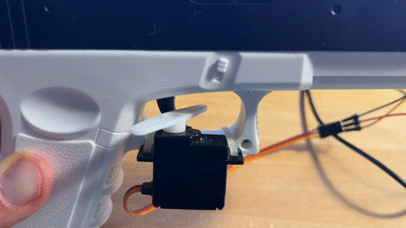
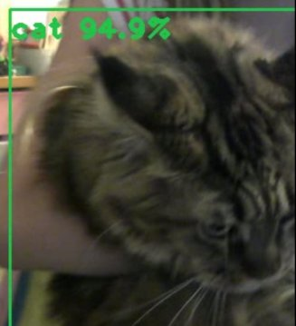
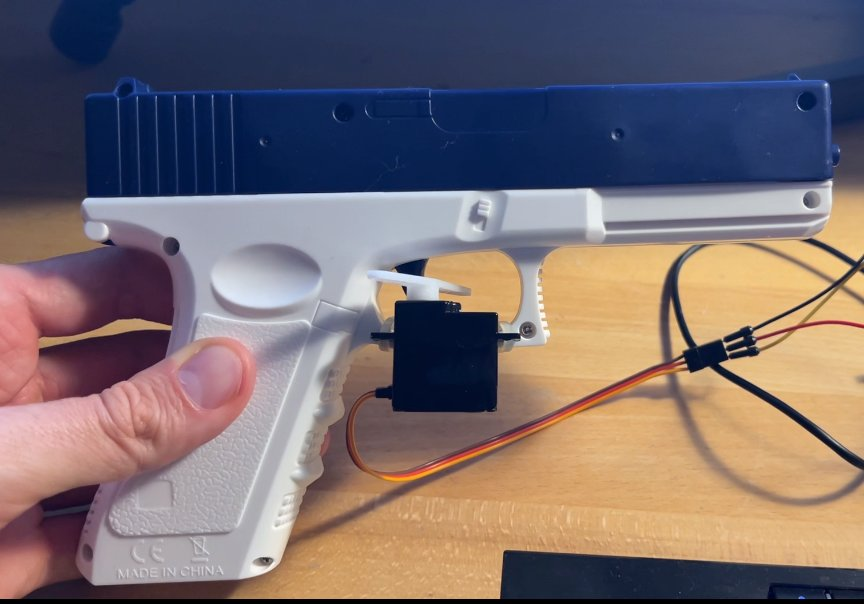
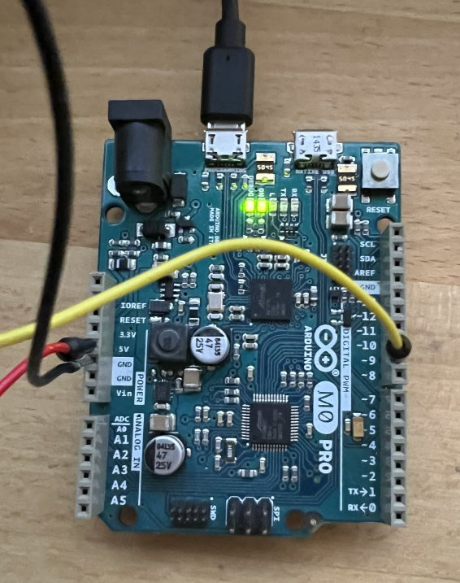
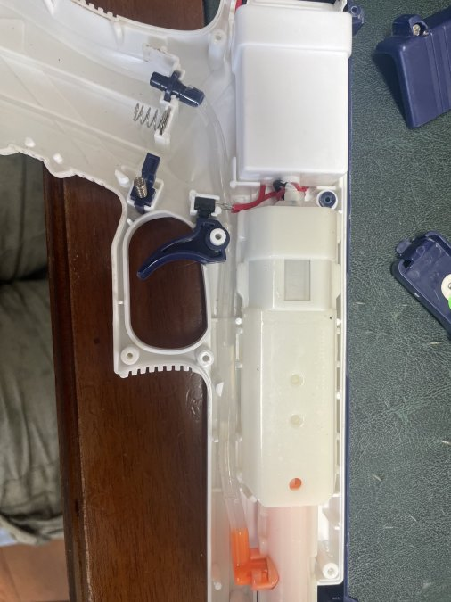
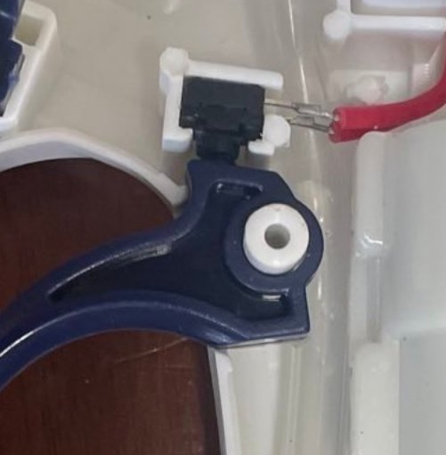

YOLO SENTRY
===========

 

Basic Idea
----------

Imagine the scene: a humble Python script, operating much like the digital eyes
of our operation, tirelessly retrieves visual frames from a webcam in
real-time. Then, in a triumphant demonstration of machine learning, it
meticulously scans these frames, engaging in a relentless pursuit for the
identification of specific objects.

Upon the triumphant detection of our predefined object classes, it doesn't just
celebrate quietly. Oh no, it promptly dispatches a directive, reminiscent of a
sci-fi communique, to the waiting, ever-ready Arduino board. This board, the
unassuming nexus of our setup, controls an actuator - a rather nifty servo, to
be precise.

And what's that, you ask, connected to this servo? It's no less than the water
pistol of destiny! Now imagine employing this intricate setup to playfully
deter a host of intruders - birds, cats, perhaps even an unsuspecting passerby.
With this awe-inspiring fusion of Python, Arduino, and a bit of creative water
usage, your space is your fortress, and you, the techno-wizard of its defense!

       ┌──────────────────────┐                           ┌────────────────────┐     ┌──────┐
       │                      │   Webcam Frame            │                    │    ┌┘      │
       │  sentry.py           ◄───────────────────────────┤                    ├────┘       │
       │                      │        USB                │    Webcam          │            │
       │                      │                           │                    │            │
       │  Running on a PC     │                           │                    ├────┐       │
       │                      │                           │                    │    └┐      │
       │                      │                           │                    │     └──────┘
       └───────────────┬──────┘                           └────────────────────┘
                       │
                       │ /dev/ttyACMXX USB serial
                       │                                  ┌─────────────────────┐
                       │                                  │                     ├──┐  Water
                       │                                  │   Water Pistol      │  ├───────────────►
                       ▼                                  │                     ├──┘
               ┌────────────────┐                         └─┬─────┬──┬──┬───────┘
               │                │                           │     │  │  │
               │                │  Pin 9 (PWM)              │     └──┴──┤
               │  Arduino       ├───────────────────────────┼─────►Servo│
               │                │  +5V, GND                 │     ┌─────┘
               │                │                           └─────┘
               └────────────────┘

Pictures
--------

Installation
------------

Install the required Python modules (assuming Python 3 is installed on your system):

    pip install pyserial
    pip install opencv-python
    pip install numpy

Download the YOLOv3 network:

    wget https://pjreddie.com/media/files/yolov3.weights
    wget https://github.com/pjreddie/darknet/raw/master/cfg/yolov3.cfg

Download the Arduino IDE

    https://www.arduino.cc/en/software

Upload the Arduino sketch in the following subfolder to your Arduino board:

    arduino_sentry/arduino_sentry.ino

The Arduino is connected to the servo motor (yellow cable) via PIN9. Black is ground and red is connected to 5V.

Connect the Arduino via USB to your computer. Check the serial port, it should normally be something like

    /dev/ttyACM0

If not, modify sentry.py and adjust the following variable:

    TRIGGER_SERIAL

Run the main script:

    python3 sentry.py

Bill of material (BOM)
----------------------

 - Arduino Board. I'm using a M0 Pro, but probably any Arduino that can control a servo should work.
 - [Electric Water Pistol](https://www.amazon.de/-/en/Electric-Automatic-Splasher-Children-Powered/dp/B0C6XPT425/)
 - Webcam. Most USB webcams should work.
 - A servo motor with PWM control
 - Two cable ties to attach the servo motor to the trigger of the water pistol

Inspired by
-----------

The overengineered solution to a pidgeon problem by Max Nagy: [https://maxnagy.com/posts/pigeons/](https://maxnagy.com/posts/pigeons/)

Other
-----

Another improvement would be the direct control of the trigger pins. Then no servo motor is required.

